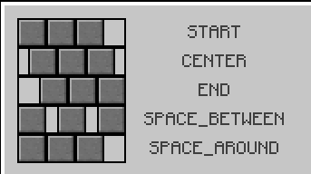

# Widget Layout, Sizing and Positioning

Each widget has several builder setter methods for position and size. They all come from the `IPositioned` interface.


## Coordinate system
- Widget coordinates are local to the widget; (0, 0) is the top-left corner of the widget.
- Positions are relative to the parent by default.

## Sizing

- `width(int)` sets the widget width in pixels
- `widthRel(float)` sets the widget width relative to its parent (e.g. if the parent is 120 px wide and we
  call `widthRel(0.5f)`, our widget will be 60 px wide)
- `height(int)` and `heightRel(float)` work analogous to previous methods
- `size(int width, int height)` is equivalent to `.width(width).height(height)`
- `size(int val)` is equivalent to `.width(val).height(val)`
- `sizeRel(float width, float height)` and `sizeRel(float val)` work analogous to previous methods
- `fullWidth()` and `fullHeight()` are shortcuts for `widthRel(1f)` and `heightRel(1f)` respectively
- `full()` combines the previous two methods
- `coverChildrenWidth()` makes the widget width wrap tightly around its children
- `coverChildrenHeight()` works analogous to previous method
- `coverChildren()` wraps width and height tightly
- `expanded()` is only useful for children of `Row` and `Column` widgets. It will make the widget expand as much as
  possible in the widgets axis (width in row and height in column)

## Positioning

We can set position on four different points, two for each axis. `left()`, `right()`, `top()` and `bottom()`.
To understand what they are doing take a look at the following picture:


As you can see the methods are fairly self-explanatory. Each of those methods has multiple variants much like `width()`
and `widthRel()`. Only methods for `left()` will be listed here.

- `left(int x)` sets the x position in pixels relative to its parent
- `leftRel(float x)` sets the x position relative to its parent (f.e. 0.5f will center the widget) 
- `leftRelOffset(float val, int offset)` is the same as `leftRel(float x)`, but also adds an `offset` in pixels after the calculation
- `leftRelAnchor(float val, float anchor)` is the same as `leftRel(float x)`, but with a different anchor
  (see [Anchor](#anchor))
- `leftRel(float val, int offset, float anchor)` combines `leftRelOffset()` and `leftRelAnchor()`
- `left(DoubleSupplier val, Measure measure)` is like `left()` and `leftRel()`, but with a dynamic value. Note that the
  supplier is only evaluated during resizing. You can't use it for animating widgets.
- `leftRelOffset(DoubleSupplier val, int offset)` is like `leftRelOffset(float val, int offset)` with a dynamic value
- `leftRelAnchor(DoubleSupplier val, float anchor)` is like `leftRelAnchor(float val, float anchor)` with a dynamic
  value
- `leftRel(DoubleSupplier val, int offset, float anchor)` combines the two methods above

All the above variants also exist for `right()`, `top()` and `bottom()`.
Additionally, there is

- `pos(int x, int y)` combines `left(int x)` and `top(int y)`
- `posRel(float x, float y)` combines `leftRel(float x)` and `topRel(float y)`
- `posRel(Alignment a)` calls `posRel(float x, float y)` using a specific alignment enum value
- `horizontalCenter()` is short for `leftRel(0.5f)`
- `verticalCenter()` is short for `topRel(0.5f)`
- `center()` is short for `posRel(Alignment.Center)`
## Anchor

The anchor is the point of the widget at which the widget will be positioned with the relative value. The following
picture should make this clear. In the picture `leftRelAnchor(0.5f, 0.3f)` is called.


Here the anchor is placed at `0.3f`, which is about a third of the widget.
And that anchor is positioned at `0.5f` of the parent widget (the center).
Try imagining what happens with different anchor values and play around with it by yourself.

If we had called `leftRel(float val, int offset, float anchor)`, then the offset would be added after the anchor
and relative position calculation.

## Combining Size and Position

You can call multiple different position and size methods, but you should be aware of its effects and limitations.

Each axis (x and y) has three setters (x has `left()`, `right()` and `width()`, y has `top()`, `bottom()` and `height()`)
without including all the variations.

!!! Note
    You can call at most two setters for each axis, since with two properties set the last one can always be calculated.

For example of you call `left()` and `right()` then the width can be calculated with `right - left`.
Setting all three properties for an axis will remove one of the other properties and log an info message.

!!! Note 
    By default, the position is (0, 0) and the size is 18x18 in pixels for most widgets.

## Changing the relative Parent

By default, the size and position are calculated relative to the widget's parent, but that can be changed with
`relative(Area)`, `relative(IGuiElement)` and `relativeToScreen()`.
The parent of all panels is by default the screen.

!!! Warning
    Changing the relative widget might cause some unexpected results in some edge cases. Please notify us if you run
    into one of those.


## Flow layout (Row / Column)
`Flow` is the core layout widget for arranging children along one axis.

- `Flow.row()` lays out children **left-to-right** (X axis).
- `Flow.column()` lays out children **top-to-bottom** (Y axis).
- `mainAxisAlignment(...)` controls how children are distributed on the main axis:
    - `START`, `CENTER`, `END`, `SPACE_BETWEEN`, `SPACE_AROUND`
    - e.g. `Flow.row().mainAxisAlignment(Alignment.MainAxis.CENTER)` centers the row's children horizontally, given that it has a set width
- `crossAxisAlignment(...)` controls alignment on the perpendicular axis:
    - `START`, `CENTER`, `END`
    - e.g. `Flow.row().crossAxisAlignment(Alignment.CrossAxis.CENTER)` centers the row's children vertically, given that it has a set height
- `childPadding(int)` adds fixed spacing between children.
- `coverChildren()` / `coverChildrenWidth()` / `coverChildrenHeight()` sizes the flow to fit its children.
- `collapseDisabledChild()` does not consider disabled children during position calculations.
    - This is useful when the enabled state of children changes dynamically.
- `reverseLayout(bool)` reverses the order that children are drawn.

Notes:

- Centering (main or cross axis) requires the flow to have a known size on that axis. If you want a row to center its children horizontally, give it a width (e.g. `widthRel(1f)` or `width(120)`).  
- By default, a `Flow` is `full()`, which means they take up as much space as their parents size.

Here is how all the MainAxisAlignments apply to widgets:




## Centering widgets
There are two common ways to center things:

1) Center a widget within its parent (positioning)

- `widget.center()` or `widget.posRel(Alignment.Center)`
- `widget.horizontalCenter()` or `widget.verticalCenter()`

2) Center children inside a Row/Column (layout)

- `Flow.row().mainAxisAlignment(Alignment.MainAxis.CENTER)` centers children along the flow's direction.
- `Flow.column().crossAxisAlignment(Alignment.CrossAxis.CENTER)` centers children perpendicular to the flow's direction.
- Remember to give the row/column a size on that axis (e.g. `widthRel(1f)` for a row).

## Margin vs padding
Spacing is handled via two different concepts:

- Margin: space outside a widget. Layouts (like `Flow`) include margins when positioning children.
    - `marginTop(px)`, `marginBottom(px)`, `marginLeft(px)`, `marginRight(px)` set the padding in pixels for the directions
    - `margin(all)`, `margin(horizontal, vertical)`, `margin(left, right, top, bottom)` are shortcuts for the respective methods
- Padding: space inside a widget. It reduces the content area and affects how children are placed.
    - `paddingTop(px)`, `paddingBottom(px)`, `paddingLeft(px)`, `paddingRight(px)` sets the margin in pixels for the directions
    - `padding(all)`, `padding(horizontal, vertical)`, `padding(left, right, top, bottom)` are shortcuts for the respective methods

## Examples

### Simple centered panel with a row of buttons
```java
ModularPanel panel = new ModularPanel("example")
        .size(176, 168);

panel.child(new ParentWidget<>()
        .size(90, 63)
        .align(Alignment.CENTER)
        .child(Flow.row()
                .coverChildren()
                .childPadding(4)
                .child(new ButtonWidget<>().size(16))
                .child(new ButtonWidget<>().size(16))
                .child(new ButtonWidget<>().size(16))));
```

### Column with padding and left-aligned content
```java
Flow column = Flow.column()
        .widthRel(1f)
        .padding(10)
        .crossAxisAlignment(Alignment.CrossAxis.START)
        .child(new TextWidget<>(IKey.str("Title")).marginBottom(4))
        .child(new TextWidget<>(IKey.str("Body")));
```

### Slot grid using absolute positioning
```java
ParentWidget<?> slots = new ParentWidget<>();
for (int y = 0; y < rows; y++) {
    for (int x = 0; x < cols; x++) {
        slots.child(new ItemSlot()
                .left(18 * x)
                .top(18 * y));
    }
}
```
