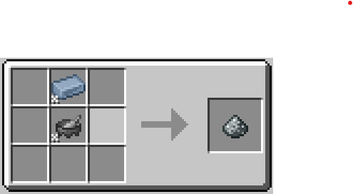
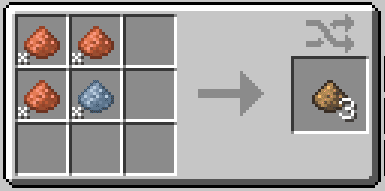

# Bronze

Bronze is the most important material in the [Steam Age](./index.md). 

To prepare the first batch of it you will need [Tin and Copper](../Ore-Generation.md).
Just crush the ingots with a GT mortar and mix them in a crafting table in a _3_ to _1_ proportion. Then smelt the resulting dust to receive the ingot.

After you get the steam [alloy smelter](Steam-Usage.md), you can get bronze faster and without needing a mortar.