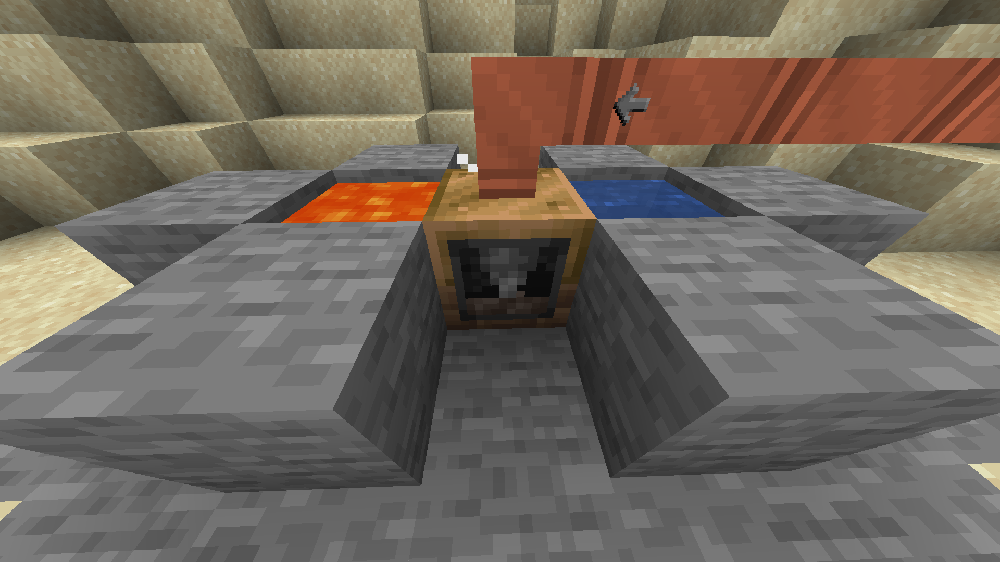

# Using Steam

After you've generated some steam, you'll need some place to use it.
That's where the machines come in, they'll provide your first bit of automation and process some recipes cheaper and
without needing durability.

### List of steam machines:

| Name          | Recipe types                 | Examples                                                                     | Low Pressure      | High Pressure |
|---------------|------------------------------|------------------------------------------------------------------------------|-------------------|---------------|
| Extractor     | Extracting                   | Rubber Log -> Raw Rubber Pulp                                                | 2 mB/t            | 4 mB/t        |
| Macerator     | Macerating/Ore Grinding      | Copper Ingot -> Copper dust                                                  | 2 mB/t            | 4 mB/t        |
| Compressor    | Compressing                  | Iron Ingot -> Block of Iron                                                  | 2 mB/t            | 4 mB/t        |
| Forge Hammer  | Forge Hammer/Ore Crushing    | Iron Ingot -> Iron Plate                                                     | 16 mB/t           | 32 mB/t       |
| Furnace       | Smelting Ore                 | Bronze Dust -> Bronze Ingot                                                  | 4 mB/t            | 8 mB/t        |
| Alloy Smelter | Alloy Smelting/Metal Molding | Copper and Tin -> Bronze Ingot                                               | 16 mB/t           | 32 mB/t       |
| Rock Crusher  | Rock Breaking                | Cobblestone, Water Source, Lava Source -> Cobblestone                        | 7 mB/t            | 14 mB/t       |
| Miner         | Automated Mining             | Mines from blocks in a 9x9 area. Generates Ores                              | 16 mB/t           | 32 mB/t       |
| Steam Grinder | Macerating/Ore Grinding      | Same as the Macerator, but it can process up to eight recipes simultaneously | 2 mB/t per recipe | -             |
| Steam Oven    | Smelting Ore                 | Same as the Furnace, but it can process up to eight recipes simultaneously   | 6 mB/t per recipe | -             |

!!! info "Special single block machines"
   
   The Rock Crusher and the Miner are special machines with additional requirements.
   
   * The Rock Crusher requires a Water source and a Lava source next to it.
      
   * The Miner needs ore blocks below it within the working area.